<h1 style="text-align: center;">LINUX THEMES </h1>
<h2 style="text-align: center;">Gnome 3 (Shell) </h2>

These are a few of the themes I put together for my GNU/Linux setups.
You can see a full resolution image of all the screenshots and/or wallpapers by clicking on the thumbnails. You can also go directly to a theme using the index.
P.S All the theme files are also hosted in this repository, should anything happen to the original ones. They can be found in the "themes" folder.

Enjoy!

***

 

## INDEX

* <a href="#MaterialSnowWhiteBitch" target="_blank">MaterialSnowWhiteBitch</a>
* <a href="#chaoticPony" target="_blank">chaoticPony</a>
* <a href="#PastelsRgr8" target="_blank">PastelsRgr8</a>
* <a href="#FlatPastelFun" target="_blank">FlatPastelFun</a>
* <a href="#GnomeInTheShell" target="_blank">GnomeInTheShell</a>
* <a href="#wall" target="_blank">Wallpapers</a>
* <a href="#extensions" target="_blank">Gnome Extensions</a>
* <a href="#resources" target="_blank">Links and Resources</a>

 

	<h3 id="MaterialSnowWhiteBitch"> MaterialSnowWhiteBitch </h3>
	<a href="https://raw.githubusercontent.com/rzro/linux-themes/master/screenshots/MaterialSnowWhiteBitch_Clean.png" target="_blank">
	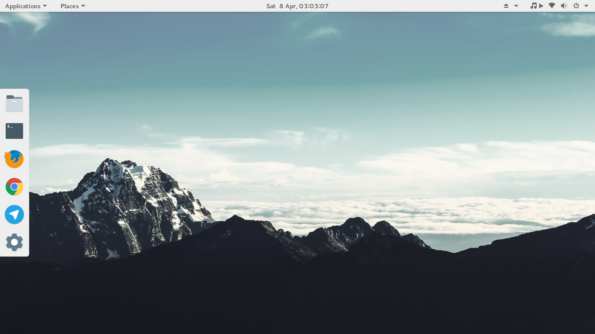</a>
	<a href="https://raw.githubusercontent.com/rzro/linux-themes/master/screenshots/MaterialSnowWhiteBitch_Dirty.png" target="_blank">
	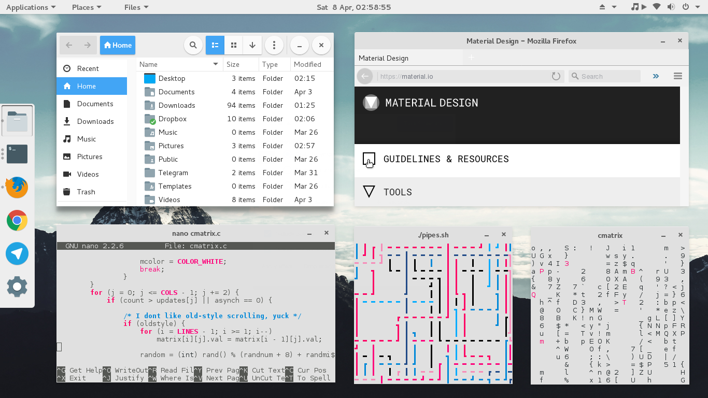</a>

*	Window: Flat-Plat-light
*	GTK+: Flat-Plat-Blue-light
*	Icons: Paper
*	Cursor: OpenZone_White_Slim
*	Shell: Numix-flatstudio-light

	#### [Check out what people are saying about this theme in /r/unixporn on Reddit!](https://www.reddit.com/r/unixporn/comments/64hlzg/gnome_material_design_materialsnowwhitebitch/)

 

	<h3 id="chaoticPony"> chaoticPony </h3>
	<a href="https://raw.githubusercontent.com/rzro/linux-themes/master/screenshots/chaoticPony_Clean.png" target="_blank">
	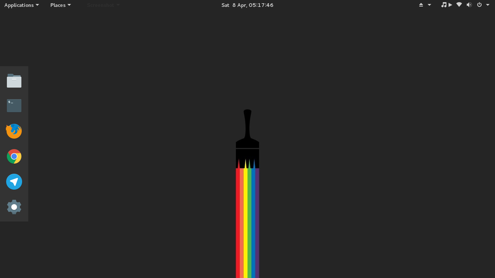</a>
	<a href="https://raw.githubusercontent.com/rzro/linux-themes/master/screenshots/chaoticPony_Dirty.png" target="_blank">
	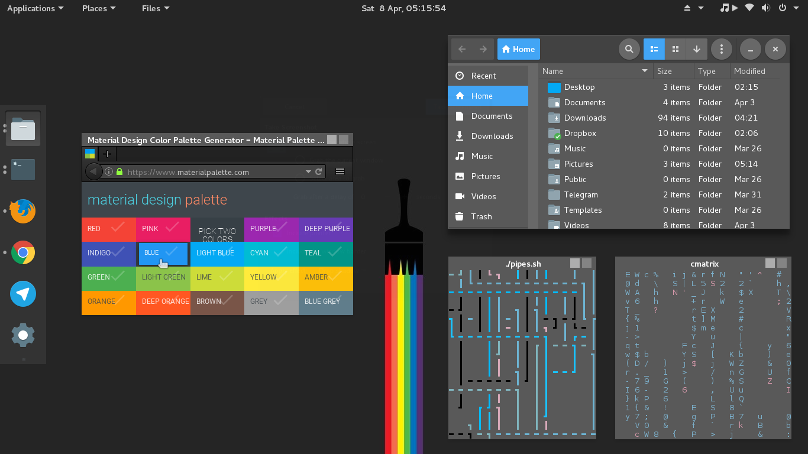</a>

*	Window: FlatStudioDark
*	GTK+: Flat-Plat-Blue-dark
*	Icons: Paper
*	Cursor: OpenZone_White_Slim
*	Shell: Numix-flatstudio-dark

	#### [Check out what people are saying about this theme in /r/unixporn on Reddit!](https://www.reddit.com/r/unixporn/comments/64hnme/gnome_dark_material_design_chaoticpony/)

 

	<h3 id="PastelsRgr8"> PastelsRgr8 </h3>
	<a href="https://raw.githubusercontent.com/rzro/linux-themes/master/screenshots/PastelsRgr8_Clean.png" target="_blank">
	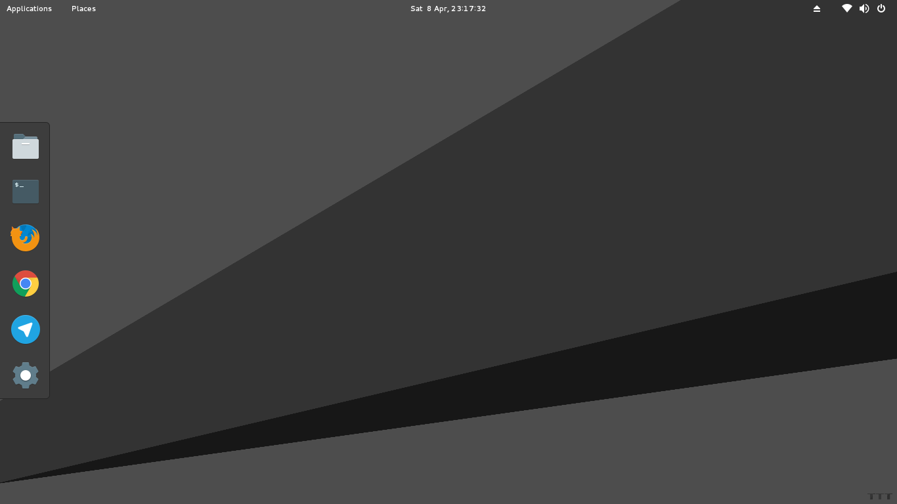</a>
	<a href="https://raw.githubusercontent.com/rzro/linux-themes/master/screenshots/PastelsRgr8_Dirty.png" target="_blank">
	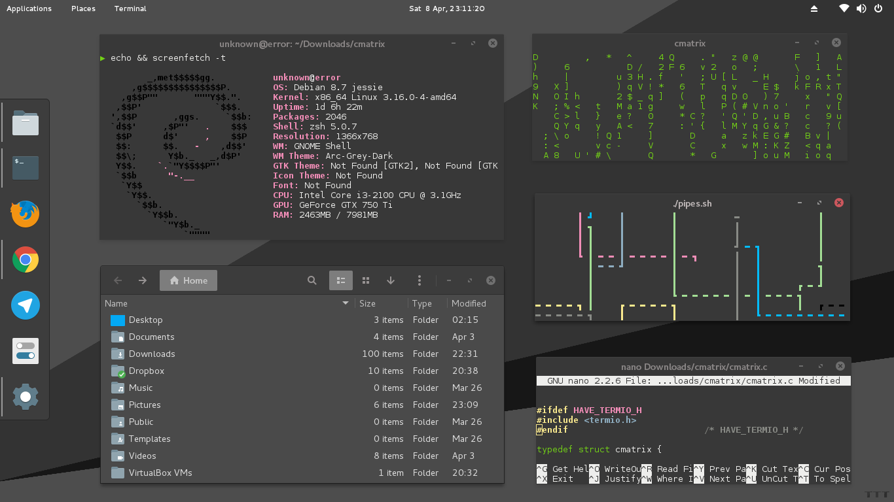</a>

*	Window: Arc-Grey-Dark
*	GTK+: Arc-Grey-Dark
*	Icons: Paper
*	Cursor: OpenZone_White_Slim
*	Shell: Arc-Grey-Dark

	#### [Check out what people are saying about this theme in /r/unixporn on Reddit!](https://www.reddit.com/r/unixporn/comments/64hpds/gnome_dark_flat_pastel_pastelsrgr8/)

 

	<h3 id="FlatPastelFun"> FlatPastelFun </h3>
	<a href="https://raw.githubusercontent.com/rzro/linux-themes/master/screenshots/FlatPastelFun_Clean.png" target="_blank">
	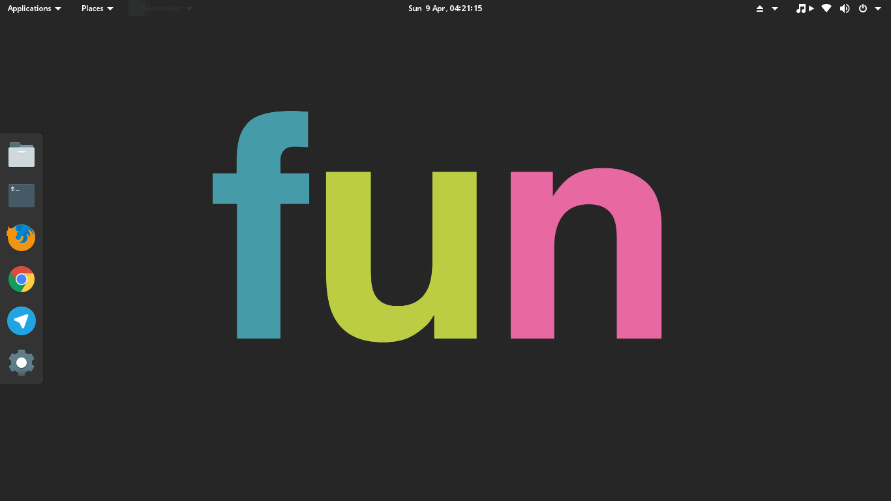</a>
	<a href="https://raw.githubusercontent.com/rzro/linux-themes/master/screenshots/FlatPastelFun_Dirty.png" target="_blank">
	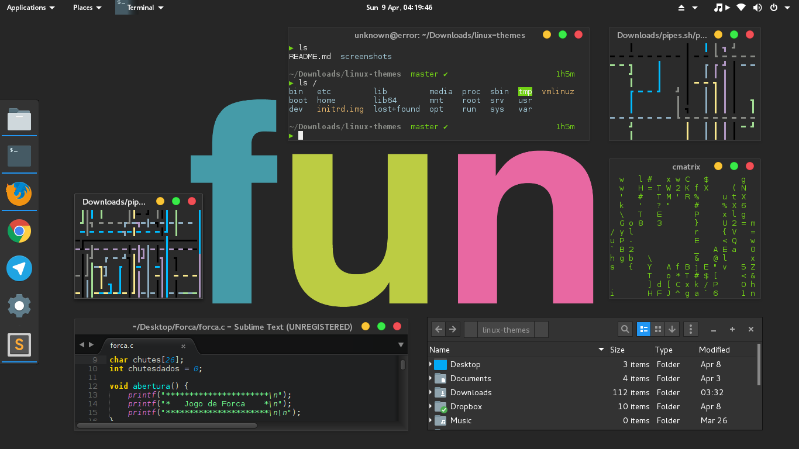</a>

*	Window: OSX Mint
*	GTK+: OSX Mint
*	Icons: Paper
*	Cursor: OpenZone_White
*	Shell: OSX Mint

	#### [Check out what people are saying about this theme in /r/unixporn on Reddit!](https://www.reddit.com/r/unixporn/comments/64hqug/gnome_dark_flat_colorful_flatpastelfun/)

 

	<h3 id="GnomeInTheShell"> GnomeInTheShell </h3>
	<a href="https://raw.githubusercontent.com/rzro/linux-themes/master/screenshots/GnomeInTheShell_Clean.png" target="_blank">
	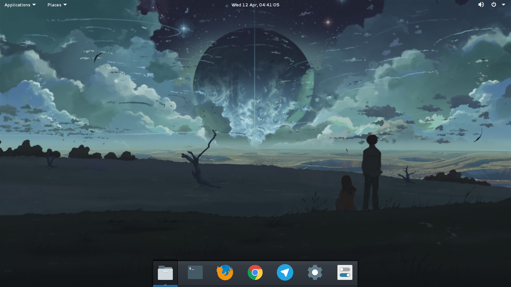</a>
	<a href="https://raw.githubusercontent.com/rzro/linux-themes/master/screenshots/GnomeInTheShell_Dirty.png" target="_blank">
	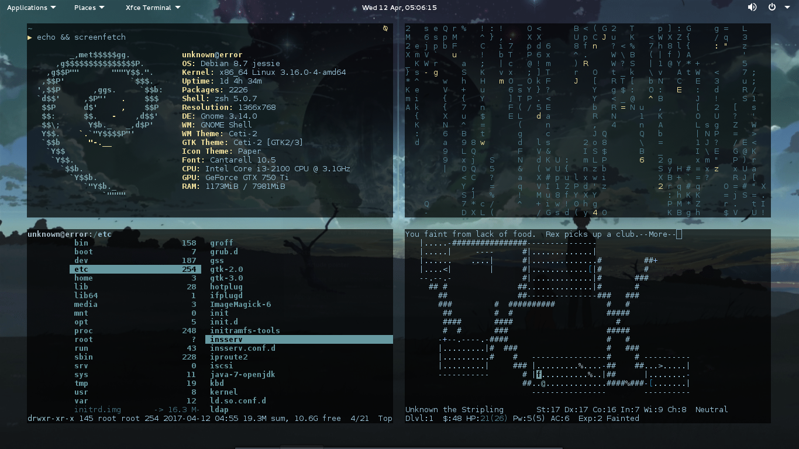</a>

*	Window: Ceti-2
*	GTK+: Ceti-2
*	Icons: Paper
*	Cursor: OpenZone_White_Slim
*	Shell: Ceti-2

	#### [Check out what people are saying about this theme in /r/unixporn on Reddit!](https://www.reddit.com/r/unixporn/comments/64x2ji/gnome_in_the_shell/)

 

	<h3 id="wall"> Wallpapers </h3>
		
			<a href="https://raw.githubusercontent.com/rzro/linux-themes/master/wallpapers/MaterialSnowWhiteBitch.jpg" target="_blank">
			
MaterialSnowWhiteBitch

			</a>
		
		
			<a href="https://raw.githubusercontent.com/rzro/linux-themes/master/wallpapers/chaoticPony.jpg" target="_blank">
			
chaoticPony

			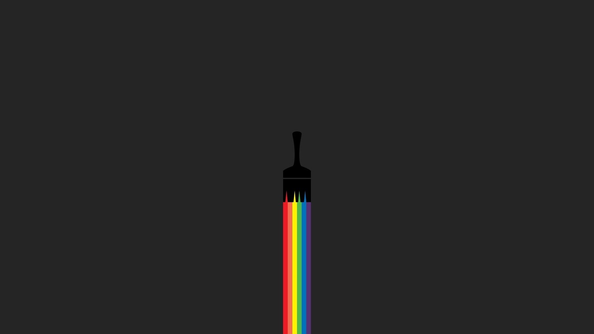</a>
		
		
			<a href="https://raw.githubusercontent.com/rzro/linux-themes/master/wallpapers/PastelsRgr8.png" target="_blank">
			
PastelsRgr8

			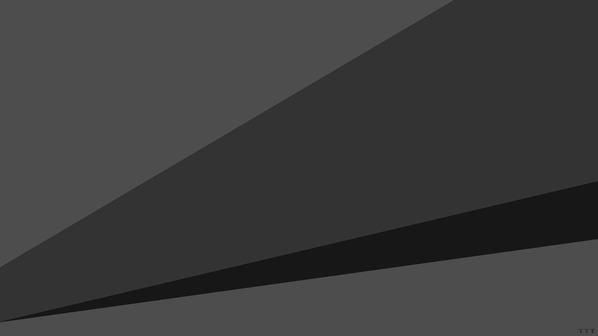</a>
		
		
			<a href="https://raw.githubusercontent.com/rzro/linux-themes/master/wallpapers/FlatPastelFun.png" target="_blank">
			
FlatPastelFun

			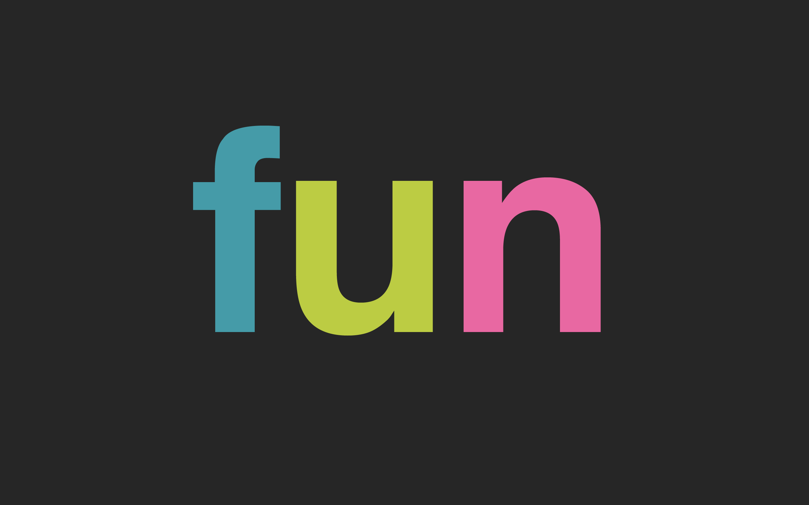</a>
		
		
			<a href="https://raw.githubusercontent.com/rzro/linux-themes/master/wallpapers/GnomeInTheShell.png" target="_blank">
			
GnomeInTheShell

			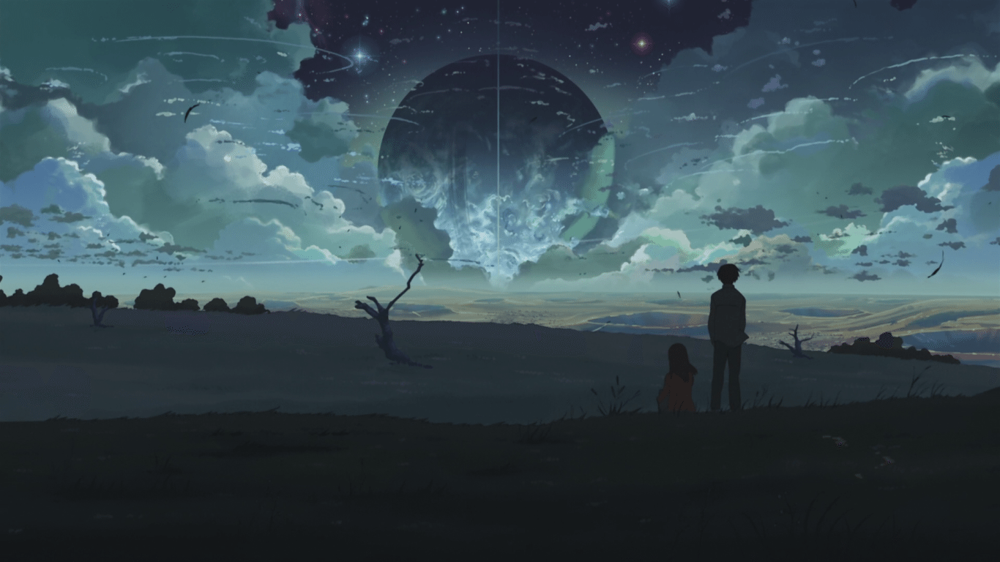</a>
		

 

<h3 id="extensions">Gnome Extensions used</h3>

* [Dash to Dock](https://extensions.gnome.org/extension/307/dash-to-dock/)
* [Dynamic Panel Transparency](https://extensions.gnome.org/extension/1011/dynamic-panel-transparency/)
* [Media player indicator](https://extensions.gnome.org/extension/55/media-player-indicator/)
* [Applications Menu](https://extensions.gnome.org/extension/6/applications-menu/)
* [Places Status Indicator](https://extensions.gnome.org/extension/8/places-status-indicator/)
* [Removable Drive Menu](https://extensions.gnome.org/extension/7/removable-drive-menu/)
* [System Monitor](https://extensions.gnome.org/extension/1064/system-monitor/)
* [User Themes](https://extensions.gnome.org/extension/19/user-themes/)

<h3 id="resources"> Links to themes and resources used</h3>

* [Theme: Flat-Plat](https://github.com/nana-4/Flat-Plat)
* [Theme: Flat-Plat-Blue](https://github.com/peterychuang/Flat-Plat-Blue)
* [Theme: Numix-GTK-Theme](https://github.com/numixproject/numix-gtk-theme)
* [Theme: Numix-FlatStudio](http://dirruk1.deviantart.com/art/Numix-flatstudio-gtk-3-12-3-14-and-3-16-theme-479126265)
* [Theme: FlatStudio](https://www.gnome-look.org/content/show.php/FlatStudio?content=154296)
* [Theme: Arc-Grey](https://github.com/eti0/arc-grey-theme)
* [Theme: OSX-Mint-Dark](https://www.gnome-look.org/p/1170721/)
* [Theme: Ceti-2](https://github.com/horst3180/ceti-2-theme)
* [Style: Firefox Stylish Add-on ](https://addons.mozilla.org/en-US/firefox/addon/stylish/)
* [Style: Firefox Stylish White-Flat ](https://github.com/rzro/linux-themes/blob/master/themes/Style_Stylish-White-Flat_Firefox.css)
* [Icons: Paper](https://snwh.org/paper)
* [Cursors: OpenZone](https://www.gnome-look.org/content/show.php/OpenZone?content=111343)

